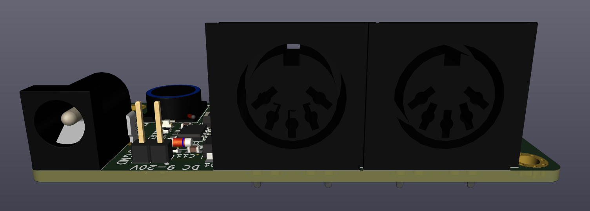
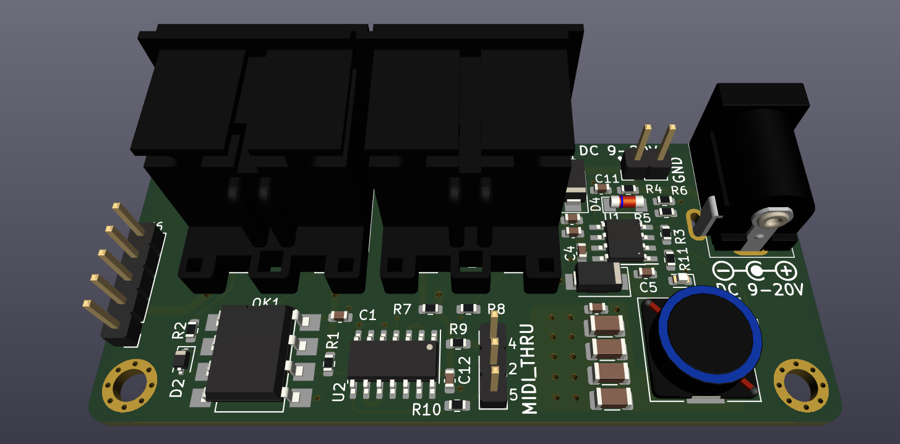
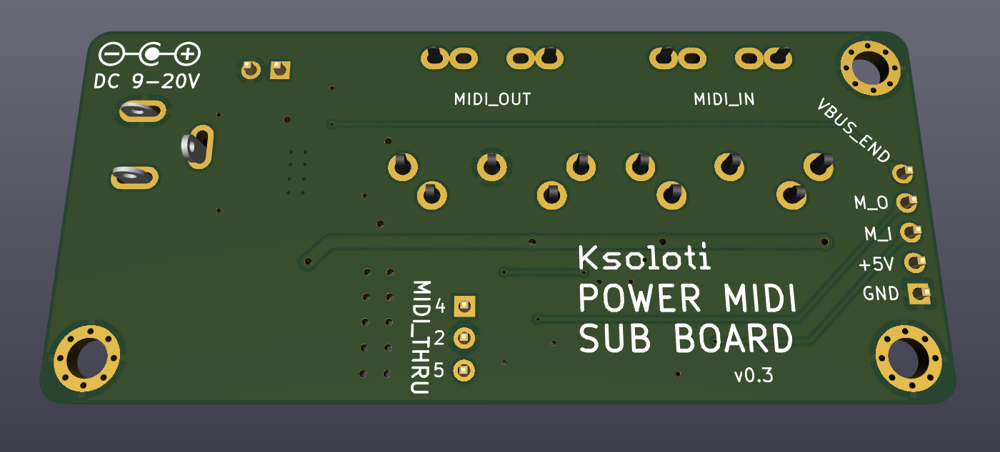

# Ksoloti Power MIDI addon board

Kicad 6+

Libraries not included, you should be able to retrieve any custom symbols and footprints via the project itself.

3D models not included, always such a hassle with those files, can't be a%$ed.

Gerbers, BOM and CPL (placement) files for JLC included. You should be able to have the board with all SMD parts produced. The remaining (through-hole) parts required are all quite common: 2.54mm headers, DIN-5 MIDI jacks, DC barrel jack...

## Disclaimer: the files are provided as is. I guarantee nothing. Stay safe and double check. If you're not sure if you're doing it right, ask someone with more knowledge for help.

## Schematic
!(ksoloti-power-midi-board.pdf)

## Rear

## Front

## Bottom

